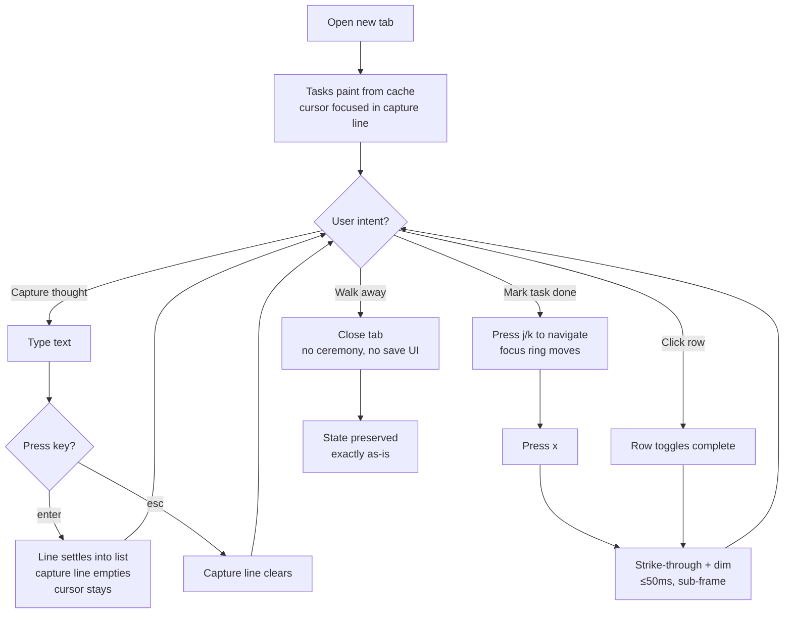
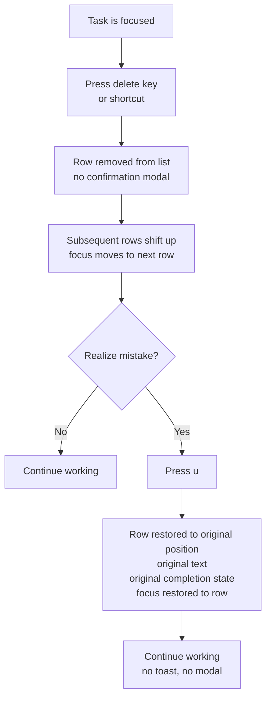
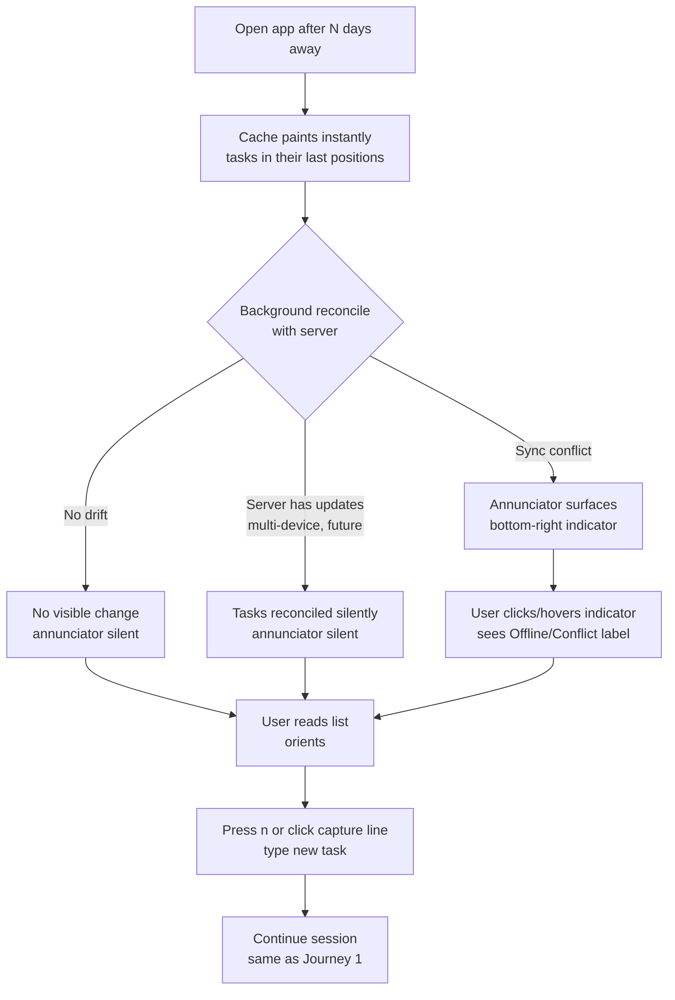
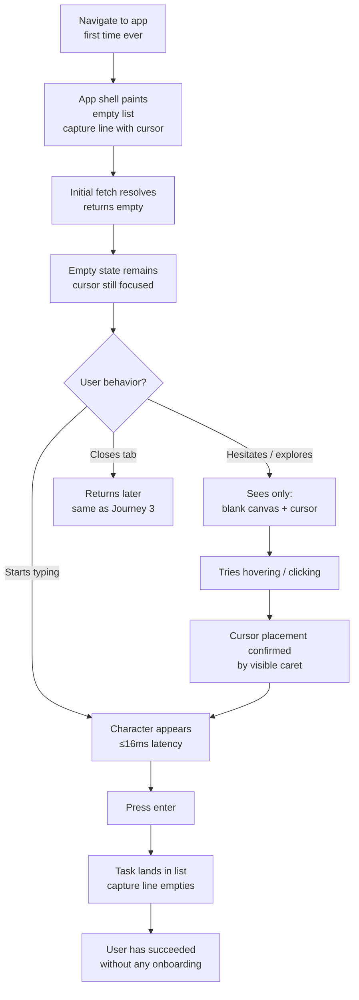
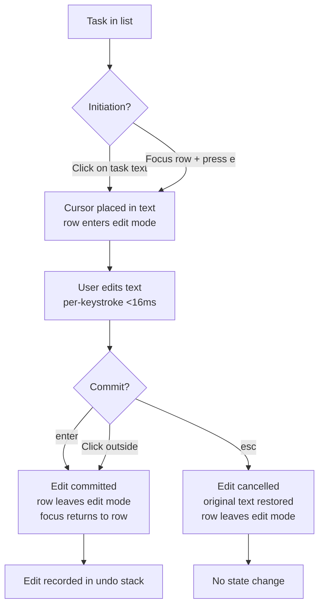
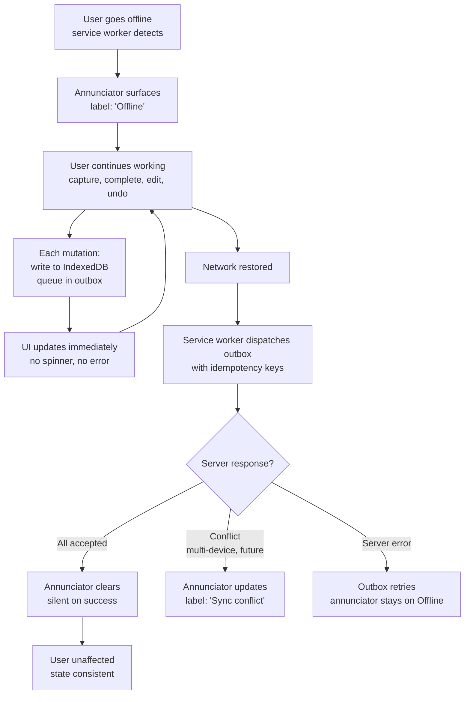

---
stepsCompleted:
  [
    "step-01-init",
    "step-02-discovery",
    "step-03-core-experience",
    "step-04-emotional-response",
    "step-05-inspiration",
    "step-06-design-system",
    "step-07-defining-experience",
    "step-08-visual-foundation",
    "step-09-design-directions",
    "step-10-user-journeys",
    "step-11-component-strategy",
    "step-12-ux-patterns",
    "step-13-responsive-accessibility",
    "step-14-complete",
  ]
inputDocuments:
  - "_bmad-output/planning-artifacts/prd.md"
  - "docs/Product Requirement Document (PRD) for the Todo App.md"
  - "_bmad-output/brainstorming/brainstorming-session-2026-04-27-1709.md"
lastStep: 14
workflowComplete: true
completedAt: "2026-04-27"
---

# UX Design Specification — bmad-todo

**Author:** Matt
**Date:** 2026-04-27

---

## Executive Summary

### Project Vision

bmad-todo is a single-user personal todo web application whose product character is its differentiator. In a category saturated with gamification, streaks, and visual chrome, bmad-todo competes on **dignified absence**: a calm, silent, instant, honest tool that reads like a journal page rather than a UI, and that fades into the background of the action. Distinctiveness comes from **what the product refuses to do** — codified in an anti-feature contract — combined with CI-enforced latency budgets and test-first rigor on every destructive operation.

### Target Users

**Primary persona — Sam, the Design-Literate Maker.** A senior designer / engineer / writer in their 30s. Has tried every personal todo app on the market and bounced off each within a week — too much chrome, unwanted gamification, default sounds, "0 tasks ✨" cheeriness. Has fallen back to `vim` + a markdown file more than once. Notices typography. Notices latency. Closes the tab the moment a UI flickers mid-keystroke. Wants a tool that gets out of the way and treats them as an adult — not a coach, accountability partner, or streak. Looking for somewhere to put a thought before it escapes, and somewhere to see what the day looked like.

The audience is deliberately narrow. Sam is the only persona for v1; no admin, support, integration developer, or onboarded-first-time-user persona is in scope. The "first-time user" experience is identical to the returning-user experience: empty list + capture line. This is a feature.

### Key Design Challenges

1. **No-chrome-at-rest without breaking discoverability.** First-time use must succeed without tours, tooltips, or onboarding. The UI must teach itself through focus and hover-reveal of affordances alone.
2. **Dual-mandate completion gesture.** Sub-50ms strike-through must feel instant _and_ human (hand-textured tick, slight per-check variance) while never blocking the next keystroke.
3. **Capture-merged-into-list.** The top row of the list _is_ the input; the visual handoff from "input" to "rendered task" on `enter` must be invisible — no flash, no shift, no flicker.
4. **Annunciator silence.** UI is calm on success and surfaces only on failure; designing the absence of feedback as legible reassurance, and the single fixed-position indicator as unmissable when needed, inverts conventional toast/spinner patterns.
5. **Both themes designed equally.** Light and dark are each first-class compositions with their own color identity (one intentional non-blue). Neither is an auto-invert of the other.
6. **Accessibility under restraint.** "No checkbox at rest" must remain programmatically present and announced. Completion state is paired with `aria-checked`; visual cues are never the sole signal.

### Design Opportunities

1. **Restraint as a visual signature.** With no chrome, each remaining element — capture cursor, typeface, column proportion, focus ring, tick texture — carries identity weight. Distinctiveness emerges from the sum of those choices.
2. **Latency as a perceptible product surface.** Optimistic writes plus a developer-mode live latency readout (`cmd+shift+L`) make the speed claim user-falsifiable in real time, turning a backend metric into a trust-building surface.
3. **The annunciator as a single iconic detail.** One fixed-position indicator, silent 99% of the time, becomes a memorable identity moment — borrowed from glass-cockpit "dark cockpit" philosophy and rare in consumer software.
4. **Hand-textured tick as the product's screenshot signature.** A small, inky, non-algorithmic completion mark — slightly different every time — that is immediately recognizable in a screenshot at 50% zoom.
5. **Empty state as composition.** A composed silence — single quiet input on a generous canvas — designed as a deliberate first-impression image that violates genre conventions on sight.

## Core User Experience

### Defining Experience

The defining moment of bmad-todo is **capture**: the user has a thought and the thought becomes a task. Everything else in the product — completion, undo, review, sync — is downstream of how that one moment feels.

The end-to-end target for capture is **<1 second from intent to captured task**, decomposed into four engineering-tested budgets:

- Cursor is already focused in the capture line on every visit (zero clicks).
- p95 keystroke → rendered character: <16ms.
- p95 `enter` → task-appears-in-list: <100ms.
- After `enter`, cursor remains focused, ready for the next thought.

If capture is perfect, the rest of the product follows. If capture has a millisecond of friction, the audience leaves. The completion gesture (`x` → strike, p95 <50ms) is the secondary moment, immediately downstream.

### Platform Strategy

bmad-todo is a **single-page web application, single-screen**. There is no client-side routing in v1; the entire surface is the list plus the capture line.

**Primary input: keyboard.** The design is optimized for a maker on a laptop with hands on the home row (`n` / `j` / `k` / `x` / `u` / `enter` / `esc` / `cmd+enter`). Pointer and touch are full first-class alternatives — every keyboard path has a pointer/touch equivalent — but the keyboard is the design's native idiom.

**Responsive by single-layout adaptation, not breakpoint variants.** The journal page is the layout at every viewport; only column width and padding scale. Mobile (<640px) uses a full-row tap target for completion to satisfy the ≥44×44px touch target rule. Swipe gestures are explicitly out of scope (they conflict with "no destructive without visible reversibility").

**Offline is a v1 requirement, not a degraded mode.** A service worker backs a cache-first read path and an offline-write outbox. The app is PWA-installable. Cached cold load paints from local state before any network round-trip; offline writes queue and replay on reconnect.

**Browser support:** Chrome / Edge / Brave / Arc / Firefox (last 2 stable), Safari 16.4+, Mobile Safari 16.4+, Chrome Android (last 2 stable). Legacy browsers, IE11, and pre-2024 Safari are out of scope. Native desktop and native mobile apps are explicitly Vision-scope, not v1.

### Effortless Interactions

The following interactions must require zero conscious thought:

1. **Opening the app.** Tasks paint from local cache before any network call. No skeleton, no "loading…". The cursor is already in the capture line on first paint of every visit after the first.
2. **Capturing a thought.** Type → `enter` → next thought. No mode switch, no "+" button, no field to focus, no metadata required.
3. **Completing a task.** `j` to focus, `x` to complete (or click row). Strike-through within 50ms, no blocking animation, immediately ready for the next gesture.
4. **Undoing.** `u`. Exact prior state restored. No confirmation modal, no toast.
5. **Returning after time away.** State is preserved exactly. No "welcome back," no overdue framing, no re-engagement nudge.
6. **Theme.** Defaults to `prefers-color-scheme`; override persists across sessions; no flash-of-wrong-theme on load.

Eliminated relative to category competitors: capture-time metadata (priority, due date, project, tags), section headers, filter chrome, onboarding flows, "saving…" indicators, success toasts.

### Critical Success Moments

These are the moments where the experience either lands or loses the user. For each, the failure mode that breaks trust irrecoverably is named, so it can be designed against:

| Moment                              | Failure that loses the user                         |
| ----------------------------------- | --------------------------------------------------- |
| First keystroke on first visit      | Cursor not focused; skeleton loader; welcome modal  |
| Mid-typing                          | UI flickers, rewrites, or guesses                   |
| First `enter`                       | Animated insertion; "added!" toast; layout shift    |
| First completion (`x` or row click) | Blocking animation; cannot press next key           |
| First `u` after a mistake           | Confirmation modal; partial restore; position drift |
| First page reload                   | Skeleton; spinner; "loading…"                       |
| First glance at empty state         | Illustration; motivational text; "no tasks ✨"      |
| First offline write                 | Spinner; "connection lost" modal; lost write        |
| First annunciator surface           | Mystery state with no recovery path                 |

The product's "this is different" moment — the wedge — sits between **first keystroke** and **first `enter`**. When Sam types and the character appears with no flicker, then presses `enter` and the task lands silently, the thesis has landed without needing to be explained.

### Experience Principles

1. **The cursor is always ready.** On every visit, every state, the capture line is focused. Effort-to-capture equals time-to-type.
2. **Calm on success, surface on failure.** Routine success is silent; toasts, success modals, and "saved!" indicators are forbidden. The single annunciator surfaces only on abnormal state.
3. **Reversibility is real and silent.** Every destructive action has a verified inverse that restores exact prior state — no modal, no confirmation, no toast.
4. **Motion communicates state, never decorates.** Every animation in the product means something changed. Decorative, ambient, and loading-flourish motion is banned. Reduced-motion degrades to instant without slowing perceived response.
5. **Restraint is the design language.** Distinctiveness emerges from the sum of refusals (no chrome, no checkbox-at-rest, no section headers, no filter UI, no "+" button, no skeletons, no spinners, no default sound). What remains carries identity weight by default.

## Desired Emotional Response

### Primary Emotional Goals

The primary emotional target for bmad-todo is **calm trust** — the quiet, unremarkable confidence one feels in a well-made notebook, a well-engineered keyboard, or a glass cockpit on a clear day. The product does not aim to create excitement, delight, or empowerment in the conventional product sense. It aims to **not create the wrong emotions** — the ambient low-grade irritation, performance anxiety, and surveillance fatigue that the productivity-app category typically produces — and to leave the user's emotional state exactly where it was before opening the app.

The "wow" moment, if there is one, is the user realizing — perhaps an hour in, perhaps a week in — that they have not been annoyed once. This is unusual emotional territory: most products aim to _produce_ an emotion. bmad-todo aims to be **emotionally invisible**.

### Emotional Journey Mapping

| Stage                         | Desired feeling                            | What produces it                                                                              |
| ----------------------------- | ------------------------------------------ | --------------------------------------------------------------------------------------------- |
| First glance (empty state)    | Quiet recognition; "Oh."                   | Composed silence — single quiet input on generous canvas. No illustration, no copy, no cheer. |
| First keystroke               | Unconscious flow                           | Cursor already focused; <16ms render; no flicker.                                             |
| First `enter`                 | Instant, silent satisfaction               | Task lands without ceremony — no toast, no animation, no "added!"                             |
| Mid-session work              | Invisibility — the tool disappears         | No interruptions; no surfaces; motion only on state change.                                   |
| First mistake recovered (`u`) | Relief; built trust                        | Instant exact-state restore; no modal; no "1 item restored."                                  |
| Closing the tab               | No emotional residue                       | No "session saved!"; no "great work today!"; tab simply closes.                               |
| Returning after time away     | Continuity — coming home to a journal page | Prior state preserved; no nag; annunciator silent.                                            |
| Something goes wrong          | Acknowledged, not alarmed                  | Single fixed-position annunciator; calm, not red-flashing; clear recovery.                    |

### Micro-Emotions

**To cultivate:**

- **Trust over surveillance** — the tool measures nothing about the user.
- **Confidence over hesitation** — destructive keys carry no fear; undo is real.
- **Calm over urgency** — no badge counts, no "overdue," no countdown.
- **Continuity over discontinuity** — every visit is the same visit.
- **Self-respect over coercion** — the tool never infantilizes, gamifies, or shames.

**To actively prevent (each one closes the tab forever):**

- **Anxiety** — overdue framing, streak loss, red badges, urgent banners.
- **Cheer-coercion** — "🎉", "Great job!", confetti, "Streak: 12 days!"
- **Surveillance** — usage stats, time-tracking, "you spent 2.3 hours today."
- **Distrust** — mid-keystroke autocomplete rewrites; layout shifts; "saving…" indicators.
- **Anticipation-grief** — dread of opening the app after time away.
- **Performance anxiety** — the feeling of being measured.

### Design Implications

| Emotion                           | UX design approach                                                                                                           |
| --------------------------------- | ---------------------------------------------------------------------------------------------------------------------------- |
| Calm trust                        | Calm-on-success / surface-on-failure; no toasts; annunciator only on abnormal state; single fixed indicator, never flashing. |
| Unboundedness                     | No "session ended," "saved!", end-of-day rituals; tab closure is unceremonious.                                              |
| Self-respect                      | No tutorial, tooltip, explanatory copy; empty state is silence, not coaching.                                                |
| Confidence in destructive actions | Real undo proven by test; no confirmation modals (which would create hesitation).                                            |
| Invisibility                      | No persistent chrome; no checkbox at rest; no "+" button; no section headers; animations only on state change.               |
| Continuity                        | Same layout across sessions; tasks at exact prior position on return; theme persists.                                        |
| Acknowledged failure              | Annunciator pattern; calm fixed-position indicator on error; recovery path visible.                                          |

### Emotional Design Principles

1. **The product never performs an emotion for the user.** No fake cheer, celebration, or concern. The product's character is constant whether the user has 0 tasks or 100, has been away an hour or a month.
2. **Silence is the default emotional register.** Every UI surface that could speak is asked: _what would it say, and is it worth more than silence?_ The default answer is silence.
3. **Trust is built by sub-second proof, not by copy.** "Real undo" is proven the first time `u` instantly restores exact state — not by a reliability claim in marketing copy.
4. **The user is treated as an adult.** No coaching, teaching, scolding, or congratulating. The product assumes competence and rewards it with restraint.
5. **Absence is the feature.** What the product does _not_ surface (streaks, stats, nags, achievements, encouragement) is doing emotional work. The user feels the absence as relief — even without consciously naming it.

## UX Pattern Analysis & Inspiration

### Inspiring Products Analysis

The audience for bmad-todo (Sam, design-literate maker) already trusts a cluster of products that cohere around restraint, typography, and respect for attention. The PRD names three spiritual neighbours; the analysis below adds adjacent products the persona is likely to respect.

**1. Bear (notes, macOS/iOS).** Typography-led. Wide leading, generous reading width, content dominates. Markdown-as-writing-surface, no floating toolbar. _Take:_ "content is the UI." _Leave:_ sidebars, tag chrome, "polished app" frame around the writing.

**2. Things 3 (Cultured Code).** Beautiful empty state, reduced per-task ceremony, Magic Plus Button as a rare _good_ "+" button. _Take:_ genre proof that productivity software can be quiet; calm zero-state composition. _Leave:_ section headers (Today/Upcoming/Someday), persistent left rail, persistent checkboxes, mandatory date metadata.

**3. iA Writer.** Single-pane writing. Custom typeface (Nitti/Duospace) carries the brand at glance. _Take:_ opinionated single typeface, one scale, generous size — type as the identity move. _Leave:_ almost nothing — iA Writer is the closest spiritual neighbour.

**4. Linear (issue tracker).** Keyboard-first, optimistic, no spinners, honest sync. "Linear was fast" is a brand attribute. _Take:_ proof that keyboard-first + optimistic + no-spinner is shippable. _Leave:_ multi-user chrome (sidebars, navigators, view switchers).

**5. vim + plain-text todo files.** Zero chrome, cursor where left, unconditional persistence, no notifications. _Take:_ the persona's anti-app benchmark — if bmad-todo doesn't feel at least as good as `vim ~/todo.md`, Sam goes back to vim.

**6. Apple Reminders / iOS Notes at their best.** Capture-from-anywhere via quick-entry. _Take:_ validation that user-typed text preserved exactly is the right default; global capture shortcut works. _Leave:_ lists-of-lists, sub-tasks, attachments, location triggers.

**7. Glass-cockpit / "dark cockpit" avionics UI.** Indicator silent unless abnormal; no "all systems nominal" green lights. _Direct transfer:_ the annunciator pattern (FR29) is borrowed from this discipline.

**8. Muji / Field Notes / Leuchtturm1917 stationery.** Quality felt before noticed — paper weight, binding, type. No branding screaming. _Direct transfer:_ journal-page metaphor is literal — the product aspires to feel like a Field Notes book.

### Transferable UX Patterns

**Layout & composition:**

- Single asymmetric column, ~640px max, generous margin — typographic publishing convention, validated in Bear / iA Writer.
- "Content is the UI" — the task list is the entire surface.
- Capture merged into top of list — adapts plain-text/vim's implicit "next-line capture" into a graphical context.

**Interaction:**

- Single-letter, no-modifier keyboard commands (`n`/`j`/`k`/`x`/`u`) — Linear-style consistency, simplified because there's only one screen.
- Global capture shortcut (`cmd+enter`) — validated by Apple Reminders / Siri / Things' Magic Plus.
- Optimistic writes, no spinner — Linear, Superhuman.
- In-place edit (click → cursor, `enter` commit, `esc` cancel) — spreadsheet idiom, immediately understood.

**Visual identity:**

- Single typeface, single scale, ≥16px — iA Writer, Bear.
- One intentional non-blue color identity — distinguishes from the tech-default blue palette.
- Hand-textured tick with per-check variance — analog detail in a digital primitive; immediately recognizable in screenshots.
- Empty state as composition (no illustration, no copy) — Things 3 calmness stripped further.

**Feedback:**

- Annunciator pattern (glass-cockpit) — single fixed-position indicator on abnormal state; calm on success.
- Strike + dim + ARIA state — visual + semantic for completion.
- Sub-frame state changes for completion — Linear-tier responsiveness.

**Persistence & sync:**

- Cache-first reads with background reconciliation — Linear, Superhuman.
- Offline-write outbox with idempotency keys — modern PWAs.
- "Reload returns home, instantly" — distinguishes from spinner-first web apps.

### Anti-Patterns to Avoid

| Anti-pattern                           | Common in                    | Why banned                                                 |
| -------------------------------------- | ---------------------------- | ---------------------------------------------------------- |
| Onboarding tour / tooltip walkthrough  | Most consumer SaaS           | Treats user as incompetent; UI must teach itself (FR46).   |
| Streaks, XP, badges, levels            | Habitica, Todoist Karma      | Productivity-as-coercion (FR48).                           |
| "0 tasks ✨" / "Great job!" cheer      | Things, TickTick, email apps | Performative cheer; condescension (FR53).                  |
| Default sound on completion            | Microsoft To Do, Reminders   | Audible interruption (FR52).                               |
| Re-engagement emails / push nudges     | Most freemium SaaS           | Surveillance + coercion (FR50).                            |
| "Haven't visited in N days" banner     | Notion, others               | Anticipation-grief (FR47).                                 |
| Streak-loss anxiety                    | Duolingo, Habitica           | Manufactured urgency.                                      |
| Mid-keystroke autocomplete rewrite     | Gmail Smart Compose          | Distrust; words modified without consent (FR51).           |
| Skeleton loaders for local data        | Most SPAs                    | Genre violation; local data should paint instantly (FR28). |
| "Saving…" on optimistic writes         | Notion, Google Docs          | Manufactures durability uncertainty (FR28).                |
| Spinners on routine actions            | Most web apps                | Feedback overhead with no information value.               |
| Confirmation modals on destructive ops | Enterprise tools             | Real undo wins; modals create hesitation.                  |
| Toasts for routine success             | Slack, Asana                 | The action _is_ the feedback (FR30).                       |
| Decorative motion (parallax, ambient)  | Marketing SaaS               | Motion that doesn't communicate state (FR53).              |
| Algorithmic / AI task reordering       | Microsoft To Do              | Position must be deterministic (FR54).                     |
| "Productivity score" surfaces          | RescueTime integrations      | Surveillance (FR47).                                       |
| Persistent left/right nav rail         | Notion, Todoist              | Chrome at rest; the app _is_ the list.                     |
| Section headers (Today / Upcoming)     | Things 3, Todoist            | Classification before capture; cognitive overhead at rest. |
| Persistent checkbox on every row       | Every traditional todo       | Visual noise; replaced by focus/hover reveal (FR15).       |
| Cargo-cult dark mode (poor contrast)   | "Added dark mode" apps       | A11y regression; both themes designed to AA (NFR-A11y-2).  |

### Design Inspiration Strategy

**Adopt directly:**

- iA Writer's "single typeface carries the brand" — one typeface, fully committed; selected in visual-design phase.
- Linear's optimistic-write + no-spinner discipline.
- Glass-cockpit annunciator pattern — direct architectural transfer.
- Bear's "content is the UI."
- Things 3's calm empty state — stripped further (no helper text).
- vim's "tool never speaks unless spoken to."

**Adapt:**

- Things' Magic Plus Button → **no button at all**; capture line permanently merged into top of list.
- Linear's keyboard-first commands → **single-letter, no-modifier**; one screen needs no modifier prefixes.
- iA Writer's focus mode → **focus as default state** (Growth: `f` for explicit single-task focus).
- Markdown / hand-drawn checkmark → **non-deterministic SVG tick** (per-check variance) — analog feel in a digital primitive.

**Refuse:**

- Every chrome surface in the anti-pattern table — no exceptions.
- Section headers, including subtle ones (no "Active" / "Completed" labels; completed tasks just dim and slide down).
- Any visual distinction between the capture line and a list row at rest — the capture line _is_ a list row in input mode.
- Auto-invert dark mode — both themes designed independently.

**Why this strategy works for the audience:** Sam already trusts products that have made these moves individually. bmad-todo's claim is that **all of them, together, in a personal todo, has not been done.** Distinctiveness comes from the unusual combination, not from a single novel UI primitive.

## Design System Foundation

### Design System Choice

**Custom design system, token-driven, utility-first via Tailwind v4 in strict token mode.** No third-party component library.

The system is built from first principles to express the project's restraint thesis. Tokens (CSS custom properties via Tailwind v4 `@theme`) are the source of truth for every visual decision; default Tailwind palettes and scales are explicitly disabled to prevent the framework's aesthetic defaults from leaking into the design. Components are hand-rolled — the v1 component inventory is small enough (7 components) that any component library is net overhead.

### Rationale for Selection

1. **Bundle constraint (NFR-Perf-6: ≤50KB initial / ≤150KB total gzipped).** Established systems (Material, Ant, MUI, Chakra) consume 80–150KB on import alone, blowing the budget before any application code is written. CSS-in-JS runtime systems also impose per-render cost that competes with the <16ms keystroke→render budget.
2. **Aesthetic constraint.** The product's core differentiator is a refusal of category visual conventions. Adopting any established system (Material, Tailwind UI components, Bootstrap) imports the visual identity it has been refining for a decade — directly undermining the distinctiveness thesis.
3. **Component surface is unusually small.** v1 has seven components (App, TaskList, TaskRow, CaptureLine, Annunciator, Tick, FocusRing). Headless primitive libraries (Radix UI, React Aria) are designed around dialogs, popovers, comboboxes — none of which exist in v1.
4. **Solo developer with craft mandate.** The product is portfolio / craft work, not feature-throughput SaaS. Hand-built is appropriate to the goal.
5. **Two themes designed independently.** Token-based theming (CSS custom properties scoped to `[data-theme]`) is the cleanest path to two compositions that share structure but differ in identity — without auto-inversion.

### Implementation Approach

**CSS framework:** Tailwind v4, in _strict token mode_. This means:

- All colors, spacing, type sizes, radii, motion durations defined in per-theme `@theme` blocks. Default Tailwind palette and scales are disabled.
- A lint rule prohibits unprefixed default-palette utilities (`bg-blue-500`, `text-gray-700`, `font-sans`). Every utility must resolve to a project token (`bg-ink`, `text-paper`, `border-rule`, `font-default`).
- Spacing scale is restrained (4 / 8 / 12 / 16 / 24 / 32 / 48 / 64 / 96), not Tailwind's full default scale.
- One typeface, no `font-sans` / `font-serif` / `font-mono` fallback families exposed to component code.

**Theming:** Two complete `@theme` blocks — `light` and `dark`. Each is a deliberate composition with its own accent color (a non-blue identity chosen for each theme independently), not an auto-inversion of the other. Theme switch via `[data-theme="light"|"dark"]` attribute on `<html>`; default driven by `prefers-color-scheme`; user override persists to `localStorage`. Theme attribute is set by an inline `<head>` script before first paint to prevent flash-of-wrong-theme.

**v1 component inventory (7 components, hand-rolled):**

| Component       | Role                                                                        |
| --------------- | --------------------------------------------------------------------------- |
| `<App>`         | Root; theme provider; focus root.                                           |
| `<TaskList>`    | Semantic `<ul>`; keyboard navigation owner.                                 |
| `<TaskRow>`     | `<li>` with embedded (visually suppressed) checkbox, text, edit affordance. |
| `<CaptureLine>` | `<TaskRow>` variant in input mode; merged into top of list.                 |
| `<Annunciator>` | Fixed-position indicator; `aria-live="polite"`.                             |
| `<Tick>`        | Non-deterministic SVG with per-instance variance.                           |
| `<FocusRing>`   | Pseudo-component (CSS); part of visual identity.                            |

**Reactive framework:** Out of scope for this document — selected in architecture phase under the bundle-size constraint (Solid, Svelte, Preact, or vanilla all viable).

### Customization Strategy

**Token discipline (load-bearing):**

- Tokens are the only source of truth. No magic numbers in component CSS. Any color, size, or duration not defined as a token is treated as a design-system bug.
- Token names are **semantic**, not literal: `--color-ink` / `--color-paper` / `--color-rule` / `--color-accent`. Semantic naming is what makes two themes work as parallel compositions rather than as the same composition with different colors.
- Motion tokens include an explicit `--motion-instant` token, used wherever `prefers-reduced-motion: reduce` applies. Reduced-motion must not slow perceived response (NFR-Perf-9).

**Type strategy:**

- Working assumption: **one typeface, one size, two weights** (regular for default text; one alternate weight reserved for state expression — likely the struck-through completed state). Pending designer confirmation that this is the literal interpretation of the PRD's "single scale."
- Body size ≥16px (FR19); generous line-height; line length capped to one comfortable reading width (~640px column max).

**Color identity:**

- One intentional non-blue accent color per theme (FR36 implies two theme compositions; the PRD says "one intentional non-blue color identity" — interpreted here as one identity _per theme_, not one identity shared across themes). Specific accent colors selected in visual-design phase.
- All color choices satisfy WCAG 2.1 AA (≥4.5:1 body text, ≥3:1 UI components) in both themes (NFR-A11y-2).

**Anti-feature lints (CI-enforced):**

- Forbidden tokens: any reference to gamification visuals (badges, trophies, streak indicators), success/celebration emoji in source (`🎉`, `✨`, `🏆`), generic Tailwind palette utilities, blue accent values not in the project palette.
- Visual-regression test on the empty/at-rest state to catch chrome drift over time (NFR-Maint-3).

## Defining Core Experience

### Defining Experience

The single interaction that defines bmad-todo — the one Sam will describe to a friend, the one whose feel determines whether the product wins or loses — is **typing a thought into a list**. Not "adding a task" with the metadata, modal, and ceremony that phrase usually implies. Just typing into the top of the list, and the line you typed becomes a task.

The verb the user uses to describe it is _write_, not _add_. The design target: capture should feel like writing, not like data entry.

### User Mental Model

Sam currently solves the capture problem in three patterns, in descending preference:

- **Best case:** `vim ~/todo.md`; `o` to open a new line; type; `:w`.
- **Common case:** plain text file in their editor of choice.
- **Failure case:** an app's todo screen — click "+", modal opens, type into a field, click another for date/priority/project, click "Save."

The mental model Sam brings is the **notebook model**, not the **form model**:

- The cursor is a pen-tip, ready at the next blank line.
- Typing is writing.
- `enter` is finishing one line and starting the next.
- The just-written line stays exactly where I put it.
- The tool is silent.

Existing graphical solutions break this model in predictable ways: "+" buttons (notebook had no button), modal forms (notebook had no form), mid-keystroke autocomplete (pen doesn't change my words), "saving…" indicators (pen doesn't talk about its ink), forced category selection (notebook doesn't ask what kind of thought this is).

bmad-todo respects the notebook model literally.

### Success Criteria

The capture interaction succeeds when it disappears from Sam's awareness on every dimension:

| Dimension                       | Success                                                                         | Failure that loses the user                               |
| ------------------------------- | ------------------------------------------------------------------------------- | --------------------------------------------------------- |
| Initiation cost                 | Zero — cursor already focused on every visit.                                   | Click to focus; tap to focus; scroll to find input.       |
| Per-character latency           | Imperceptible (<16ms p95).                                                      | Visible lag; mid-word repaint.                            |
| Per-character behavior          | Each character appears exactly as typed.                                        | Autocorrect; autocomplete rewrite; mid-keystroke flicker. |
| Commit cost                     | Single `enter`.                                                                 | Mouse confirmation; required-field error; modal close.    |
| Commit visual                   | Line settles into list in place; new blank line in same position. No animation. | Animated insertion; layout shift; "added!" toast.         |
| Commit → next-capture readiness | <100ms p95; cursor still in capture position.                                   | Cursor moves; focus lost; need to refocus.                |
| Persistence guarantee           | Implicit; never communicated.                                                   | "Saving…" / "saved!" — either signals doubt.              |
| Repeat cost                     | Type → `enter` → type → `enter`. Indefinite.                                    | Per-task ceremony of any kind.                            |

**Macro success criterion:** Sam can capture four tasks in under five seconds without touching the mouse and without thinking about the app.

### Novel UX Patterns

Capture-into-the-top-of-a-list is **a novel composition built entirely from established patterns**. Each individual pattern is well-understood in adjacent contexts; the novelty is the assembly.

| Component pattern                   | Established in                                         | Novelty here                                                                                                  |
| ----------------------------------- | ------------------------------------------------------ | ------------------------------------------------------------------------------------------------------------- |
| Always-focused single-line input    | Chrome new-tab address bar; Spotlight; Alfred; Raycast | Applied to a task list, not a search field.                                                                   |
| Type → `enter` → next item          | Plain-text editing; chat composers; markdown lists     | Applied with no decoration — the line just appears.                                                           |
| Auto-prepend (newest first)         | Twitter/Mastodon timeline; Discord channels            | Applied without animation, unread count, or arrival ceremony.                                                 |
| Capture-anywhere global shortcut    | macOS Spotlight; Alfred; Raycast; Things' Quick Entry  | Mapped to `cmd+enter` from any browser tab.                                                                   |
| Capture line _merged into_ the list | vim / markdown / plain-text editing                    | The genuinely unusual move — most graphical apps separate the input from the list. bmad-todo erases the seam. |

**No user education is required.** Every component pattern is one Sam has used thousands of times. The "new" thing is the absence of the boundary between input and list — which registers as relief, not confusion. The mental-model bridge: text editing applied to a list of structured items.

### Experience Mechanics

**1. Initiation**

- _On app open:_ Cursor focused in the capture line at the top of the list. No click. No focus animation. No placeholder copy.
- _After each commit:_ Cursor remains in the capture line.
- _Global:_ `cmd+enter` from any browser tab opens the app focused in the capture line (PWA install enables cross-tab availability).
- _Focus stickiness:_ App never steals focus from the capture line. Completion (`x`), navigation (`j`/`k`), and theme toggle do not change capture-line focus — they only move a separate keyboard cursor through tasks.

**2. Interaction**

- _Input:_ Plain text, single line. No formatting, markdown rendering, syntax highlighting, autocomplete, or spell-check rewrite (browser's underline-on-misspelling is user-controlled and untouched).
- _Per-keystroke render:_ Character appears in <16ms p95. No layout reflow. No flicker.
- _Length limit:_ Backend enforces ≤10,000 chars (NFR-Sec-2); the user never approaches this. No counter or warning surfaced.
- _Pointer/touch:_ Tap or click on the capture line places the cursor. On mobile, no auto-focus (avoids summoning the keyboard unbidden) — user taps to begin.

**3. Feedback**

- _During typing:_ The character is the feedback. Nothing else.
- _On `enter`:_ Current line settles into a list row in place — same position, same typography. Capture line below it becomes empty and stays focused. Visual handoff is identical-visuals, cursor-is-the-only-difference: zero animation, zero layout shift.
- _On `esc` while typing (cancel):_ Capture line clears. No commit, no toast.
- _On empty / whitespace-only `enter`:_ No-op. No error.
- _On persistence failure:_ Annunciator surfaces in corner. The just-typed task is **not lost** — held in local cache and outbox; reconciles on next online check.

**4. Completion (of the capture interaction)**

- _Successful outcome:_ Task in the list immediately below the capture line. Capture line empty and focused. Persistence implicit and trusted.
- _What's next:_ User captures another task; or `j` to navigate; or walks away — state at moment-of-stop is state on next return.
- _No session-end event._ No completion banner, no end-of-day summary, no "you've added N tasks today."

### Decisions Captured From This Step

- **Placeholder text in empty capture line:** None. Pure cursor on blank row. Maximally restrained; aligns with "UI teaches itself."
- **Mobile auto-focus:** Off. Mobile users tap once to focus, which summons the keyboard. Desktop auto-focuses unconditionally.
- **Visual seam between input mode and rendered task:** None. Capture line and rendered task share identical visual treatment; the only visual difference is the blinking cursor in input mode. The capture line is permanently the top row of the list, always present, always blank when not actively typing. Pressing `enter` commits the typed text as a row beneath, and the capture line above remains the active input — never relocated, never reflowed.

## Visual Design Foundation

### Color System

The visual identity uses two independent theme compositions — neither an inversion of the other — each with its own non-blue accent. Both themes are warm-leaning, evoking physical objects (paper, lamplight) rather than typical cool-tech screens.

**Light theme — "Field Notes paper":**

| Token               | Value (illustrative)        | Role                                  |
| ------------------- | --------------------------- | ------------------------------------- |
| `--color-paper`     | `#F4EFE6` warm off-white    | Background                            |
| `--color-ink`       | `#1F1A14` warm near-black   | Body text                             |
| `--color-ink-muted` | `#1F1A1499` (60% ink)       | Completed-task text                   |
| `--color-rule`      | `#1F1A1422` (faint ink)     | Focus baseline                        |
| `--color-accent`    | `#9C3B1B` rust / terracotta | Cursor, focus ring, tick, annunciator |

**Dark theme — "Reading-lamp coffee":**

| Token               | Value (illustrative)            | Role                                  |
| ------------------- | ------------------------------- | ------------------------------------- |
| `--color-paper`     | `#1A1612` warm dark brown-black | Background                            |
| `--color-ink`       | `#E8DFCE` warm cream            | Body text                             |
| `--color-ink-muted` | `#E8DFCE99` (60% ink)           | Completed-task text                   |
| `--color-rule`      | `#E8DFCE22` (faint ink)         | Focus baseline                        |
| `--color-accent`    | `#6B8E7F` verdigris / patina    | Cursor, focus ring, tick, annunciator |

**No additional colors.** No success-green, error-red, warning-yellow. The 5-token palette per theme is the entire system. Status communication happens through layout, opacity, and presence — not through color semantics. The annunciator uses accent color, never red — calm, not alarming.

All exact hex values are illustrative; finalized in implementation against measured contrast ratios.

### Typography System

**Typeface (recommended): Fraunces** — a free, variable serif with strong personality at body sizes. Pushes hardest on "reads like a journal page," and is the move most under-occupied in the todo category (most competitors use humanist sans).

Final selection committed at implementation start; alternative candidates if Fraunces is later judged off-direction:

- iA Writer Quattro / Duospace (proportional-mono hybrid; literal iA Writer reference)
- Mona Sans (humanist sans; safer, less differentiated)

**Type scale (locked):**

- **One size: 18px body.** Capture line and rendered tasks share identical type. There are no headings (the product has no navigation, sections, or modals).
- **One weight: 400 Regular.** State expression uses opacity and the strike-line, not a second font weight. (Strict reading of the PRD's "single scale" mandate.)
- **Line height:** 1.55 — generous, journal-page feel.
- **Letter spacing:** 0 (Fraunces' optical-size axis handles spacing per size).
- **Optical size:** `opsz: 14` (small-text optical variant) — only variant shipped.

**Font loading:**

- Self-hosted, woff2, subsetted to Latin + Latin-Ext.
- `font-display: block` for ≤200ms, then `swap`. Prevents flash-of-unstyled-text on first-ever load. Cached cold loads use the locally cached font and have no FOUT risk.
- Estimated subsetted variable woff2: ~100KB — fits within total bundle budget given how lean the rest of the app is.

### Spacing & Layout Foundation

**Spacing scale:** 4 / 8 / 12 / 16 / 24 / 32 / 48 / 64 / 96 px (Tailwind v4 strict-token-mode).

**Column proportions:**

| Property         | Desktop (≥1024px)  | Tablet (640–1024px) | Mobile (<640px) |
| ---------------- | ------------------ | ------------------- | --------------- |
| Column max-width | 640px              | 640px               | viewport - 48px |
| Left margin      | 96px (anchored)    | 64px                | 24px            |
| Right margin     | viewport remainder | 32px                | 24px            |
| Top margin       | 96px               | 64px                | 48px            |

**The asymmetric column** is anchored to a fixed left offset on desktop, not horizontally centered. The right margin fills the remaining viewport. This gives the page a deliberate compositional asymmetry — typographic-page proportions rather than UI-frame proportions.

**Inter-row rhythm:**

- Vertical spacing between tasks: **16px**.
- Per-row internal padding: 8px top/bottom; 0 left/right (text aligns flush to column edge).

**Annunciator placement:** fixed, bottom-right of viewport, 24px from each edge. 16px × 16px circular indicator. No persistent label; hover/focus reveals a single short phrase ("Offline" / "Sync conflict" / "Storage error").

**Focus ring:** custom (not browser default). 2px solid ring in `--color-accent`, offset 4px from element bounds. Designed as part of visual identity.

### Accessibility Considerations

- **Contrast ratios** verified for both themes: body ink on paper ≥4.5:1 (target ≥7:1 AAA where geometry allows); muted ink on paper (completed-task text) ≥4.5:1; accent on paper (focus ring, tick, annunciator) ≥3:1.
- **Focus indicator is never color-only** — the 2px ring is a non-color signal; the accent color is reinforcement.
- **Completion state** (strike + dim) paired with `aria-checked="true"` on the embedded checkbox; visual cues are never the sole signal.
- **Type size 18px** with 1.55 line height and ≤640px line length = comfortable reading; remains usable to 200% zoom without horizontal scroll.
- **Reduced motion:** all transitions degrade to instant under `prefers-reduced-motion: reduce`. The strike-through animation collapses to immediate state change with zero perceived-latency cost.
- **High contrast** (`prefers-contrast: more`): body ink darkens to maximum; accent saturates; rule lines move to full ink-muted. Tested as a separate composition, not auto-derived.
- **No checkbox at rest** is implemented as a _visually suppressed_ but _programmatically present_ checkbox — screen readers always announce completion state.

## Design Direction Decision

### Design Directions Explored

The standard "explore 6–8 directional variations" exercise was deliberately collapsed at this step. The cumulative locks from earlier steps — single asymmetric column, no chrome at rest, capture merged into the list, single typeface and weight, two warm themes with non-blue accents, no semantic color, motion-only-on-state-change — remove the design space in which alternative directions could be generated without violating prior decisions. Generating contrarian mockups (sidebar-and-tabs, card-based, kanban, Material) would each directly violate one or more locked decisions and would be performative documentation rather than honest exploration.

The single direction was instead visualized as a state showcase at `_bmad-output/planning-artifacts/ux-design-directions.html`, covering eight states across both themes: empty (light/dark), mid-typing, navigating with keyboard focus, end-of-day with multiple completions, annunciator surfaced, and mobile (light/dark).

### Chosen Direction

Summarized; full detail in earlier sections:

- Single asymmetric column anchored at left+96px (desktop), ≤640px max-width, generous right margin.
- Fraunces 18px, single weight (400), 1.55 line height — one type level for the entire app.
- Two warm themes with their own non-blue accent: rust on warm paper (light), verdigris on warm coffee (dark). Five tokens per theme; no semantic color (no green / red / yellow).
- No chrome at rest — no "+" button, no section headers, no nav rail, no persistent checkbox.
- Capture line is permanently the top row of the list; visually identical to a rendered task except for the blinking cursor.
- Custom 2px focus ring in the accent color, 4px offset — designed as part of identity.
- Annunciator: single small circular indicator, accent-colored, fixed bottom-right (24px from each edge). Silent unless abnormal.
- Hand-textured SVG tick with per-instance Bezier control-point variance — slightly different every time.
- Motion communicates state only. `prefers-reduced-motion` collapses to instant with zero perceived-latency cost.

### Design Rationale

The product's distinctiveness thesis is restraint, not novelty. The audience (Sam) recognizes the aesthetic by the sum of refusals (no chrome, no checkbox at rest, no "+" button, no section headers, no toasts, no spinners), reinforced by a small set of distinctive positive moves (asymmetric column, warm non-blue palette, single serif typeface, hand-textured tick). Each of those positive moves was chosen against the cool-tech default of the category. Together they produce a screenshot that is recognizable in a thumbnail as not a typical todo app.

This direction satisfies, by construction:

- **PRD vision:** "reads like a journal page, not a UI" — single column, single typeface, generous type, no headers, warm palette.
- **Anti-feature contract (FR46–54):** every banned surface is architecturally absent, not optionally hidden.
- **Bundle constraints (NFR-Perf-6):** seven hand-rolled components, no component library, ~100KB variable-font budget.
- **Accessibility (NFR-A11y):** AA contrast in both themes; focus ring is non-color-only; completion paired with `aria-checked`; generous type and line-length make 200%-zoom and screen readers comfortable.
- **Latency (NFR-Perf-1/2/3):** no decorative motion, sub-frame state change on completion, identical-visual handoff on capture-commit — no animation between input and rendered states.

### Implementation Approach

Implementation proceeds in a deliberate order that lets the design language land progressively, with a visual-regression snapshot at each step to prevent drift:

1. **Tokens first.** Per-theme `@theme` blocks with finalized hex values, verified against contrast targets. Tokens precede component code.
2. **Empty state.** The simplest but most-screenshotted state. Lock typography, asymmetric column, and capture-line behavior here.
3. **Single rendered row.** Validates that rendered task and capture line share identical visual treatment.
4. **Focus + completion.** Validates keyboard navigation, the focus ring, the strike + dim, and the hand-textured tick (with variance shipped as part of the visual identity).
5. **Annunciator.** Smallest surface, most distinctive identity moment. Includes `aria-live="polite"` region and calm fixed-position indicator.
6. **Mobile.** Single-layout adaptation; column edge-padding swap; auto-focus disabled.

**Legitimate micro-variations to revisit during visual implementation (none affect the thesis):**

| Point                           | Default                   | Alternative                        |
| ------------------------------- | ------------------------- | ---------------------------------- |
| Capture-line baseline at rest   | None — cursor only        | Faint 1px rule under cursor        |
| Tick texture style              | Bezier-variance clean ink | More irregular charcoal-mark feel  |
| Completed-row strike-line color | Body ink                  | Accent color (stronger identity)   |
| Focused-row indicator           | Inline checkbox box       | Subtle left-edge accent bar        |
| Annunciator label visibility    | Hover/focus reveal        | Always-visible when surfaced       |
| Mobile capture-line affordance  | Tap-to-focus, no rule     | Tap-to-focus + faint baseline rule |

**Explicitly out-of-scope as variations** (these are rejected categories, not rejected designs): multi-column layouts, section headers, filter UI, modal capture, light-as-pure-white, dark-as-pure-black, cool/blue palettes, sans-serif typography (in the recommended direction), multiple typefaces or weights or sizes, skeleton loaders, spinners, toasts, decorative motion, algorithmic ordering, AI suggestions, smart sorting.

## User Journey Flows

### Journey 1 — Capture, Work, Review (PRD J1)

**Goal:** Sam adds tasks, completes some, glances at the day, walks away.



**Mechanics:**

- _Entry:_ Browser tab → tasks already painted from IndexedDB cache (FR22). No skeleton, no spinner. Capture line auto-focused on desktop (FR2).
- _Capture loop:_ Type → `enter` → repeat. Each `enter` = single committed task; cursor never leaves capture line.
- _Completion loop:_ `j`/`k` = navigate focus ring through tasks (focus ring is separate from capture-line focus — capture line never loses its caret). `x` = toggle complete.
- _Mouse alternative:_ Click anywhere on a row = toggle complete. Click on text = enter inline edit.
- _Exit:_ No save action. State persists implicitly (FR21).

**Failure modes designed against:**

- Cursor lost focus after `enter` → must remain in capture line.
- Animation blocks next keystroke → strike-through is sub-frame, no block (NFR-Perf-2).

### Journey 2 — Delete + Undo (PRD J2)

**Goal:** Sam deletes the wrong thing; recovers in <1 second; trust built.



**Mechanics:**

- _Delete:_ Single keystroke (or button-equivalent). Soft-delete server-side; outbox-replayed.
- _Undo (`u`):_ Pops the top of the session undo stack. Restores **exact prior state**: text, position, completion status, focus position (FR13).
- _Stack scope:_ Session-long. Covers completion, deletion, edit (FR12).
- _No UI ceremony:_ No "1 item restored" toast. The action is the feedback.

**Edge cases:**

- _Multiple destructive actions in a row:_ Each `u` reverses one step; stack is LIFO.
- _Undo while offline:_ Local stack works the same; the undo operation queues an inverse mutation in the outbox.
- _Reload mid-session:_ Undo stack is session-scoped; lost on reload. Acceptable per PRD (cross-session undo is in Growth; NFR-Rel-4 retains 30-day soft-delete on server for future cross-session undo).

### Journey 3 — Return After Absence (PRD J3)

**Goal:** Sam returns after days away; finds state preserved; no nag, no celebration.



**Mechanics:**

- _Entry:_ Same as J1 — cache-first paint. The cache may be days/weeks old; that's fine. Reconciliation is background.
- _No re-engagement:_ No "Welcome back" banner. No "N tasks overdue." No streak. No "haven't visited in N days." (FR50, FR47.)
- _Reconciliation visibility:_ Calm-on-success. The user does not see the reconcile happening unless something is wrong.
- _Annunciator surfaces only on:_ offline state, sync conflict, persistence write error (FR29). Hover/focus reveals a single short label.

**Why this matters:** "Anticipation-grief" (Step 4) is what we're explicitly preventing. The user should be able to open the app after a month with the same emotional cost as opening it after an hour.

### Journey 4 — First-Ever Visit (Empty State)

**Goal:** A first-time user — no cached tasks, no instructions — succeeds at the core loop without help text.



**Mechanics:**

- _No tour, no tooltip, no welcome modal_ (FR46).
- _App shell paints first._ The empty state is the app shell — not a separate "loading" state. The empty state is interactive immediately even before the network fetch resolves.
- _Pre-fetch capture:_ Per Step 3, the user can begin typing before the initial fetch returns. The user-typed task is held locally and posted on first connect.
- _UI-teaches-itself:_ Sam has used Spotlight, Alfred, Chrome's URL bar, vim. The "blank canvas + cursor" composition is unambiguously interactive to anyone who has typed in a computer in the last 30 years.

**Failure mode designed against:**

- A first-time user who freezes because they don't see a "+" button → mitigated by the cursor's blinking presence as the affordance.
- The PRD treats this risk as acceptable: the audience is self-selecting (Sam persona), and the empty state is the genre violation that signals "this is different."

### Journey 5 — Inline Edit

**Goal:** Sam corrects a typo or rewrites a task in place, without leaving the list view.



**Mechanics:**

- _Initiation:_ Click on task text or focus row + `e` (FR8, FR35 — no modal dialog for edit).
- _Edit-mode visual:_ Same row, same typography. The only difference is the text-input cursor placed within the text. No surrounding box, no "save" button, no toolbar.
- _Per-keystroke:_ Same <16ms latency budget as capture (NFR-Perf-1).
- _Commit:_ `enter` or click-outside. `esc` cancels (matches spreadsheet idiom).
- _Persistence:_ Optimistic write; outbox dispatch on commit. Undo stack records a snapshot before edit (FR12).

**Edge cases:**

- _Empty after edit:_ Whitespace-only commit treated as a request to **delete with undo**. (Single behavior; recoverable via `u`.)
- _Edit mid-completed-task:_ Allowed. Editing does not change completion state. Strike-through follows the new text.

### Journey 6 — Offline Write + Reconcile

**Goal:** Sam captures tasks while offline; reconciliation is silent on reconnect.



**Mechanics:**

- _Offline detection:_ Service worker fetch failures + `navigator.onLine` events. Annunciator surfaces only after a transient threshold (e.g., >2s of failures) — avoids flicker on momentary blips.
- _Local-only operation:_ All MVP operations work offline (FR27). The UI does not change behavior; the only visible difference is the annunciator presence.
- _Outbox:_ Each mutation queued with an idempotency key (NFR-Rel-5). Order preserved across reconnect (NFR-Rel-6).
- _Reconcile:_ Outbox dispatched on reconnect. No "syncing N items" toast. No progress bar.
- _Conflict resolution:_ v1 has no multi-device, so conflicts shouldn't occur. If they do, the annunciator surfaces "Sync conflict" and a single resolve action is offered. Multi-device conflict design is Growth-scope.

### Journey Patterns

Patterns repeated across all flows, lifted into a single statement so component design can implement them once:

1. **Capture-line focus stickiness.** The capture line keeps its caret across all task-row interactions. Navigation focus (`j`/`k`) is a separate visual cursor (the focus ring) that moves through tasks. Theme toggle, completion, deletion, and undo never steal focus from the capture line. Click-into-task-text for edit _temporarily_ claims focus; commit/cancel returns it to the capture line.
2. **Decision-point silence.** No flow contains a confirmation modal. No flow shows a success toast. Decisions are made by keystroke or click; the resulting state change is the only feedback.
3. **Annunciator as the single failure surface.** Every flow that can fail (sync, persistence, offline) routes its failure into the annunciator. No flow has its own error UI.
4. **Optimistic-everything.** Every flow renders the user's intent immediately and reconciles in the background. No flow has a "wait for server" path that the user can perceive.
5. **Sub-frame state changes.** Every state change (commit, complete, undo, edit-commit) renders within one frame. No flow contains a transition animation that delays the next user action.
6. **Reversibility via the same primitive.** Undo (`u`) reverses any state-changing operation across all flows. There are not separate "undo delete" / "undo complete" / "undo edit" affordances.

### Flow Optimization Principles

1. **Steps to value ≤1.** Capture: 1 keystroke per character + 1 `enter`. Complete: 1 keystroke. Undo: 1 keystroke. No flow has more steps than its underlying mental model.
2. **Cognitive load is zero at every decision point.** No flow asks the user a question they didn't already mean to answer (no "are you sure?", no "save before exit?").
3. **Progress indicators are absent because progress is not the right concept.** Optimistic writes mean state is current as of the last keystroke. There is nothing for a progress indicator to indicate.
4. **Error recovery is universal.** Every destructive action is undoable. Every failed sync state is annunciator-surfaced. There is no flow that can leave the user stranded.
5. **Delight is the absence of friction, not the addition of moments.** No flow has an intentional "delight moment" (confetti, microcopy, easter egg). The delight is the cumulative absence of irritation.

## Component Strategy

### Design System Components

No design system components are pulled from a library. Per Step 6, the system is custom and token-driven; Tailwind v4 provides utilities only, not components. Every component below is hand-rolled. The seven-component inventory (set in Step 6) is a complete cover of all journey requirements; coverage gap = zero.

### Custom Components

#### `<App>`

**Purpose:** Root component. Owns theme, focus root, and global keyboard handler. Renders the asymmetric column container.

**Anatomy:**

- Outer `<html data-theme="light|dark">` attribute wrapper (set by inline `<head>` script before paint).
- Single `<main>` element containing the column.
- Inline `<head>` script reads `localStorage.theme` || `prefers-color-scheme` and sets `data-theme` attribute synchronously — prevents flash-of-wrong-theme.
- Renders `<CaptureLine>` first (top), then `<TaskList>`, then `<Annunciator>`.

**States:** None (stateless wrapper).

**Variants:** None.

**Accessibility:**

- `<main>` is the single landmark. No `<header>` / `<nav>` / `<aside>` (there is no navigation, no header content).
- `<html lang="en">` per browser default.
- `<title>` is project name only — no task counts in `<title>` (no measurement of the user; FR47).

**Behavior:**

- Owns global keyboard shortcuts: `n` (focus capture line), `j`/`k` (navigate task list), `x` (toggle complete on focused row), `u` (undo), `e` (edit focused row), `cmd+enter` (cross-tab quick capture — registered via PWA), `cmd+shift+L` (reveal dev latency display).
- Owns dev-latency display toggle (FR44) — hidden by default, `aria-hidden="true"` when shown.

#### `<TaskList>`

**Purpose:** The list of tasks. Owns the keyboard-navigation focus cursor that moves through rows.

**Anatomy:**

- Semantic `<ul role="list">`.
- Children are `<TaskRow>` instances, newest first (FR11).
- Empty state: zero children. The capture line above it carries the empty composition.

**States:**

- _Empty:_ zero children rendered. No "no tasks" placeholder text.
- _Populated:_ one or more `<TaskRow>` children.
- _Focus active:_ one row has `data-focused="true"`; the others do not. Focus is owned here, not inside `<TaskRow>`.

**Variants:** None.

**Accessibility:**

- `<ul>` exposes the count to screen readers natively.
- Roving `tabindex` pattern: focused row is `tabindex="0"`, others are `tabindex="-1"`. `j`/`k` move the focus pointer; only one row at a time is in the tab order.
- Arrow keys (`ArrowUp` / `ArrowDown`) work as `j` / `k` aliases for users who don't know the vim binding.

**Behavior:**

- On mount, no row is focused (focus stays in capture line).
- First `j` press focuses the first task; first `k` press from no-focus also focuses the first task.
- Focus can leave the list (returns to capture line) by typing a printable character or pressing `n`.

#### `<TaskRow>`

**Purpose:** A single task. The most-rendered component. Has three primary states: at-rest, focused, edit.

**Anatomy:**

```
<li role="listitem" data-focused="..." data-completed="...">
  <input type="checkbox" aria-label="Mark complete" /> /* visually suppressed at rest */
  <Tick />  /* rendered only when completed */
  <span class="task-text">{text}</span>  /* contenteditable when edit state */
</li>
```

**States:**

| State               | Visual                                                                                                                     | Behavior                                                                                     |
| ------------------- | -------------------------------------------------------------------------------------------------------------------------- | -------------------------------------------------------------------------------------------- |
| At rest, active     | Plain text, full ink color, no checkbox visible.                                                                           | Click on text → enter edit; click on row (outside text) → toggle complete.                   |
| At rest, completed  | Plain text + strike-through + `--color-ink-muted` (60% opacity). `<Tick>` rendered to the left, accent color.              | Click toggles back to active.                                                                |
| Focused (active)    | Focus ring around row (2px accent outline, 4px offset). Checkbox box visible to left of text — empty box.                  | `x` toggles complete; `e` enters edit; `delete`/`backspace` deletes; `j`/`k` navigates away. |
| Focused (completed) | Focus ring + checkbox box visible with `<Tick>` inside. Text struck and dimmed.                                            | Same key bindings.                                                                           |
| Hover               | Same as focused without the focus ring (mouse-only affordance preview).                                                    | Click to interact.                                                                           |
| Edit                | `contenteditable` text element with text-input cursor placed within. No focus ring on the row (focus is _inside_ the row). | Type to edit; `enter` commits; `esc` cancels; click-outside commits.                         |

**Variants:** None — same component renders all states via data attributes.

**Accessibility:**

- `<input type="checkbox">` is **always programmatically present**, even when visually hidden. Hidden via `clip-path: inset(50%)` (the accessible-hidden pattern), not `display: none` — must remain in the accessibility tree (FR42, NFR-A11y-5).
- `aria-checked` reflects completion state on the checkbox.
- Strike-through is paired with `aria-checked="true"`; opacity-dim never the sole signal (FR16).
- Edit-mode text element uses `contenteditable="plaintext-only"` to prevent paste-formatting attacks.
- Focus ring is via `:focus-visible` selector, never via `:focus` — prevents focus rings on mouse-click interaction (UX standard).

**Content guidelines:**

- Text rendered as plain text only (FR4, NFR-Sec-1) — no HTML, no markdown, no syntax highlighting.
- No truncation. Long task text wraps; row height grows. Line-clamp explicitly not applied (per "user-typed text exactly preserved").

**Behavior:**

- Click on text region → edit mode (Journey 5).
- Click on row outside text region → toggle complete (Journey 1).
- On completion toggle: strike-through and tick render within the same frame as the click handler; no animation. Under `prefers-reduced-motion: reduce`, identical behavior.

#### `<CaptureLine>`

**Purpose:** The permanent input row at the top of the list. Visually identical to a `<TaskRow>` at rest except for the blinking cursor.

**Anatomy:**

```
<input
  type="text"
  class="capture"
  aria-label="Add a task"
  autocomplete="off"
  spellcheck="true"
  enterkeyhint="done"
/>
```

Not a `<form>` — single input, `enter` triggers commit handler directly. Sits structurally above `<TaskList>` (not as a `<TaskRow>`).

**States:**

| State                            | Visual                                                                                     | Behavior                                                    |
| -------------------------------- | ------------------------------------------------------------------------------------------ | ----------------------------------------------------------- |
| Empty + focused                  | Blank line, blinking text-input cursor (browser default + accent color via `caret-color`). | Type to enter content.                                      |
| Empty + unfocused (mobile only)  | Blank line, no cursor visible.                                                             | Tap to focus.                                               |
| Has content                      | Typed text rendered in the same typography as a task row.                                  | `enter` commits; `esc` clears.                              |
| Persisting (transient, internal) | Visual identical to "has content".                                                         | Outbox dispatch happens behind the scenes. No "saving…" UI. |

**Variants:** None.

**Accessibility:**

- `aria-label="Add a task"` provides screen-reader name (no visible label).
- `enterkeyhint="done"` hints "Done" key on iOS/Android keyboards.
- `autocomplete="off"` — browser-level autocomplete is off (we don't want suggestions appearing mid-keystroke per FR51). The browser's spell-check underline remains user-controllable.

**Behavior:**

- _On app open (desktop):_ auto-focused on mount.
- _On app open (mobile):_ not auto-focused (avoids summoning keyboard unbidden — Step 7 decision).
- _On `enter`:_ commits content as new task at top of list; clears input; cursor remains in capture line.
- _On `esc`:_ clears input; no commit; cursor remains.
- _On empty/whitespace `enter`:_ no-op (no commit, no error).
- _Capture-line focus stickiness (Journey Pattern 1):_ Theme toggle, completion `x`, navigation `j`/`k`, and undo `u` do **not** steal focus from the capture line. Edit-mode entry temporarily moves focus into a `<TaskRow>`; on commit/cancel, focus returns to capture line.
- _Per-keystroke render:_ <16ms p95 (NFR-Perf-1). Implementation uses uncontrolled input with synchronous render to avoid framework-reconciliation overhead on every keystroke.

#### `<Annunciator>`

**Purpose:** The single failure surface for the entire app. Silent on success; surfaces only on abnormal state.

**Anatomy:**

```
<div
  class="annunciator"
  role="status"
  aria-live="polite"
  data-state="silent | offline | conflict | error"
>
  <span class="annunciator-dot" />
  <span class="annunciator-label">{label}</span>  /* hover/focus reveal */
</div>
```

Fixed positioned: `bottom: 24px; right: 24px`.

**States:**

| State            | Visual                                                                                    | Label revealed on hover/focus |
| ---------------- | ----------------------------------------------------------------------------------------- | ----------------------------- |
| Silent (default) | `display: none` — not rendered to viewport, not announced.                                | —                             |
| Offline          | 12px circle, `--color-accent`, with subtle 4px halo (`color-mix` of accent at 18% alpha). | "Offline"                     |
| Sync conflict    | Same dot.                                                                                 | "Sync conflict"               |
| Storage error    | Same dot.                                                                                 | "Storage error"               |

(All states use the same accent color — calm, not red. Differentiation is via the label, not the color — per Step 8.)

**Variants:** None.

**Accessibility:**

- `role="status"` + `aria-live="polite"` — screen readers announce state changes without interrupting (FR43, NFR-A11y).
- Label is keyboard-focusable when surfaced (`tabindex="0"`); arrow-keys past it via the global tab order.
- Click on the annunciator (when surfaced) triggers a contextual recovery action: for "Offline", retry pending writes; for "Sync conflict", open inline conflict resolver; for "Storage error", display a local file-export option (so the user can save their data manually if persistence is broken).

**Behavior:**

- Surfaces only after a transient threshold (>2s of failures) to avoid flicker on momentary network blips.
- Disappears (returns to silent) when the abnormal state clears — no "all clear" announcement.
- Multiple abnormal states resolve to the most-severe single label (storage error > sync conflict > offline).
- Never red-flashes. Never animates (motion would violate FR53). Presence is the signal.

#### `<Tick>`

**Purpose:** The hand-textured completion mark. The product's most distinctive visual signature.

**Anatomy:**

- 14×14 inline SVG with a single `<path>`.
- Path is generated at component mount with **per-instance Bezier control-point variance**: jitter the two control points within ±0.4px of canonical positions. Each tick rendered is slightly different.
- Stroke: `--color-accent`, 2.2px, round line-cap and line-join.

```
<svg viewBox="0 0 14 14" aria-hidden="true">
  <path d={generateTickPath(seed)} />
</svg>
```

**States:** None — the tick is either rendered or not. Once rendered, its variance is fixed for the lifetime of the row.

**Variants:** None.

**Accessibility:**

- `aria-hidden="true"` — decorative; the underlying state is announced via the checkbox's `aria-checked` (Step 8 decision: "decorative, doesn't depend on the tick visual").

**Behavior:**

- Rendered when `<TaskRow data-completed="true">`.
- Variance is generated once per row instance (using the task's stable id as a seed) and cached. If a task is uncompleted and re-completed, the tick is the same — except for newly-created completion states, which get a fresh variance.
- Property-based test asserts that two consecutive `<Tick>` instances are not pixel-identical (validates that variance is real — Innovation Validation, PRD Innovation section).

#### `<FocusRing>`

**Purpose:** Pseudo-component (not a React/framework component — implemented as CSS only). Renders the visible focus indicator on any focusable element.

**Anatomy:**

- CSS only:
  ```css
  :focus-visible {
    outline: 2px solid var(--color-accent);
    outline-offset: 4px;
    border-radius: 2px;
  }
  ```

**States:**

- _Visible:_ element has `:focus-visible` (keyboard or programmatic focus).
- _Hidden:_ element has only `:focus` (mouse-click focus) — no ring.

**Variants:** None.

**Accessibility:**

- `:focus-visible` is the standard for "show focus ring only when keyboard-navigated" — meets WCAG 2.4.7 Focus Visible.
- Outline (not box-shadow) — survives high-contrast mode and Windows High Contrast (`forced-colors`) cleanly.
- 2px / 4px offset is unambiguous regardless of theme; non-color signals (the offset) reinforce the color (FR42, NFR-A11y-5).

**Behavior:**

- Applied via cascade to: `<input>` in capture line, focused `<TaskRow>` (via `[data-focused="true"]`), the annunciator when surfaced.

### Component Implementation Strategy

**Stylistic discipline:**

- All components use only project tokens — no magic numbers, no default Tailwind colors (Step 6 lint rule).
- All components ship with a visual-regression snapshot test (default + each documented state).
- All interactive components ship with an automated keyboard-only test (NFR-A11y-3).
- All components are tested with axe-core in CI (NFR-A11y-1).

**State management:**

- Components are presentational. State (task list, focus index, undo stack, theme, annunciator state) lives in a single store (whatever framework's idiomatic primitive).
- The undo stack is part of the store, not part of any component — Journey Pattern 6 ("undo via the same primitive across all flows") requires this.

**Performance discipline:**

- `<CaptureLine>` is uncontrolled — its content is _not_ in framework state on every keystroke. Synchronous render to satisfy NFR-Perf-1.
- `<TaskList>` does **not** virtualize for v1 (typical user task count is well under 100; virtualization adds complexity that isn't load-bearing). Re-evaluate at Growth scope.
- `<Tick>` variance is computed once at mount and cached on the row's data attributes — not regenerated on re-render.

### Implementation Roadmap

Roadmap mirrors the visual-direction implementation order (Step 9), now with explicit component dependencies:

**Phase 1 — Foundation (precedes any flow)**

1. **Tokens** — per-theme `@theme` blocks in `globals.css`. Verified contrast in CI.
2. **`<App>`** — theme attribute setter, layout shell, global keyboard handler skeleton.
3. **`<FocusRing>`** — CSS only; lands as part of `<App>`.

**Phase 2 — Capture loop (J1, J4)** 4. **`<CaptureLine>`** — uncontrolled input, auto-focus on desktop, `enter`/`esc` commit/cancel. 5. **`<TaskList>`** — `<ul>` shell; renders empty state correctly (no children). 6. **`<TaskRow>`** at-rest variant — text only, no checkbox visible.

Phase 2 enables J4 (first-ever visit) end-to-end. Visual-regression snapshot of empty state locks the "screenshot signature."

**Phase 3 — Completion (J1)** 7. **`<TaskRow>`** focused + completed variants — checkbox-on-focus, completion toggle, strike+dim. 8. **`<Tick>`** — variance generation, accent-stroke rendering. 9. **Keyboard navigation** — roving tabindex in `<TaskList>`, `j`/`k` handlers in `<App>`.

**Phase 4 — Reversibility (J2, J5)** 10. **Undo stack** — store primitive; covers complete, uncomplete, delete, edit. 11. **`<TaskRow>`** edit variant — `contenteditable`, commit/cancel handlers. 12. **`u` keystroke** — pops undo stack and dispatches inverse mutation.

Phase 4 enables J2 and J5.

**Phase 5 — Persistence + sync (J3, J6)** 13. **Service worker + IndexedDB cache** — read-through cache; cold-paint from cache. 14. **Outbox + idempotency keys** — offline-write queue; reconcile on reconnect. 15. **`<Annunciator>`** — connected to sync state; surfaces only on abnormal state.

**Phase 6 — Polish + a11y verification** 16. **`prefers-reduced-motion` + `prefers-contrast` paths** — verified. 17. **Manual screen-reader pass** (VoiceOver macOS+iOS, NVDA Windows; NFR-A11y-4). 18. **Dev-mode latency display** (FR44) — keyboard-revealed, `aria-hidden`. 19. **PWA manifest + install path**.

The roadmap front-loads the visual identity (Phases 2–3) so the project's distinctiveness lands early and visibly, before backend complexity (Phase 5) accumulates.

## UX Consistency Patterns

### Pattern Category Coverage

| Category                   | Treatment in bmad-todo                             |
| -------------------------- | -------------------------------------------------- |
| Buttons                    | None — no buttons in the app.                      |
| Form patterns + validation | None — capture line is the only input.             |
| Modals + overlays          | None — forbidden by Journey Pattern 2.             |
| Toasts + notifications     | None — forbidden by FR30.                          |
| Loading states + skeletons | None — forbidden by FR28.                          |
| Search / filtering         | None in v1 (Growth scope).                         |
| Navigation                 | None — single screen.                              |
| Empty states               | One pattern, deliberately minimal.                 |
| Feedback patterns          | One pattern: annunciator-only on abnormal state.   |
| Focus + selection          | One pattern: roving tabindex + accent focus ring.  |
| Destructive actions        | One pattern: undo-as-the-confirmation.             |
| Theme switching            | One pattern: persisted attribute toggle.           |
| Keyboard shortcuts         | One discoverability pattern: progressive learning. |

The patterns documented below cover only the categories that _do_ exist. Each one references the journey pattern and component spec it implements, so the spec stays single-source.

### Empty-State Pattern

**When to use:** App initial render with zero tasks (Journey 4) and any state where the list is empty after deletion.

**Visual:** Capture line at top of column with blinking cursor (or unfocused on mobile). `<TaskList>` renders zero children. No placeholder text, no illustration, no helper copy, no "add your first task" coaching.

**Behavior:**

- The cursor is the only affordance signaling interactivity (desktop).
- Mobile: tap on the column area focuses the capture line; otherwise idle.

**Anti-patterns explicitly avoided:**

- Illustrations of empty inboxes, success checkmarks, or "all done" imagery.
- Motivational text ("Start your day strong!", "What will you accomplish today?").
- Onboarding hints ("Type a task and press Enter").
- Stats ("0 tasks completed today").

**Rationale:** PRD vision; FR17. The empty state is the most-screenshotted state of any todo app and the highest-leverage moment to violate genre conventions on sight.

### Feedback Pattern (the only one)

**When to use:** Any abnormal system state — offline, sync conflict, persistence error.

**Routing rule (load-bearing):** _All_ failure feedback in the app routes to `<Annunciator>`. There is no other failure-feedback surface anywhere in the product. Components do not render their own error UIs.

**Visual + behavior:** See `<Annunciator>` component spec (Step 11). 12px circular dot, accent color, fixed bottom-right with 24px viewport offset, label revealed on hover/focus.

**Threshold:** Surfaces only after a transient failure threshold (>2s of failures). Avoids flicker on momentary network blips.

**Resolution:** Disappears silently when state clears — no "all clear" announcement.

**Anti-patterns explicitly avoided:**

- Per-action error toasts. Per-component error states. Modal error dialogs. Inline error labels under inputs. Red banners. Audible alerts. Browser-tab badge counts. Push notifications.

**Rationale:** Glass-cockpit "dark cockpit" philosophy (PRD Innovation #5); FR29, FR30, NFR-A11y.

### Destructive-Action Pattern

**When to use:** Any state-changing operation — task deletion, completion toggle, edit commit.

**Pattern: undo-as-the-confirmation.** Destructive actions execute immediately with no confirmation prompt. The session-long undo stack is the safety net. `u` reverses the last destructive action with exact-state restoration.

**Visual:** No modal, no confirmation prompt, no "Are you sure?" The action's effect is the only visible response.

**Behavior:** See `<TaskRow>` component spec; FR12, FR13; Journey 2.

**Anti-patterns explicitly avoided:**

- Confirmation modals on delete.
- "Type DELETE to confirm" pattern.
- Multi-step delete flows.
- "Recently deleted" archive surface in v1 (Growth scope only).
- "1 item restored" toast on undo.

**Rationale:** PRD Journey 2; FR12; emotional principle "trust is built by sub-second proof, not promises" (Step 4).

### Focus + Selection Pattern

**When to use:** Any keyboard-driven navigation; any focus indicator.

**Pattern:** Roving `tabindex` within `<TaskList>`. Only one task is `tabindex="0"` at a time; `j` / `k` / `↑` / `↓` move it. The visible focus ring uses `:focus-visible` — keyboard-only; mouse clicks do not show the ring.

**Two-cursor model (load-bearing):**

1. **Capture-line caret** — the text-input cursor. Always present (desktop), always in the capture line.
2. **List focus ring** — keyboard navigation pointer. Moves through tasks via `j`/`k`. Independent of #1.

The two cursors coexist. Pressing `x` (with the focus ring on a task) toggles that task's completion _without_ moving the capture-line caret.

**Visual:** See `<FocusRing>` spec — 2px accent outline, 4px offset.

**Anti-patterns explicitly avoided:**

- Click-to-select-then-act pattern (everything is direct: click a row to toggle, click text to edit).
- "Select multiple" affordances. No multi-select in v1.
- Browser-default focus rings (replaced by custom).

**Rationale:** Step 7 mental-model decision; Journey Pattern 1; NFR-A11y-3.

### Theme-Switching Pattern

**When to use:** User-initiated theme override (a future settings surface, post-MVP) or default selection on first load.

**Pattern:**

1. On document load, an inline `<head>` script reads `localStorage.theme` (if set) or `prefers-color-scheme`. Sets `data-theme` attribute on `<html>` _before first paint_.
2. CSS resolves theme tokens via `[data-theme="..."]` selectors.
3. User toggle (when added) updates `localStorage` and the attribute synchronously.

**Visual:** No flash-of-wrong-theme. No transition animation between themes (a theme change is a deliberate state change, but the transition itself is decorative — would violate FR53).

**Anti-patterns explicitly avoided:**

- Theme detection via JavaScript after first paint (causes flash).
- Auto-invert dark mode (Step 6 decision).
- Animated theme transition (decorative motion).

**Rationale:** Step 8 theming approach; FR36-39.

### Keyboard-Discoverability Pattern

**When to use:** Helping the user learn the keyboard shortcuts without a tour or persistent on-screen help.

**Pattern (v1):** Two complementary surfaces — progressive discovery for the keyboard-native user, plus a `?`-triggered overlay for explicit lookup:

- **Progressive discovery (default path).** The user discovers shortcuts by trying or by reading the README:
  - `enter` and `esc` are universal idioms — no learning needed.
  - `j` / `k` are vim's idiom; the persona (Sam) likely already uses them. Arrow keys are aliases for users who don't.
  - `x`, `u`, `e`, `n`, `t` are short, mnemonic, single-keystroke.
- **`?` shortcut overlay (lookup path).** Pressing `?` (when no editable target is focused) reveals a centered overlay listing every global shortcut and its action. Dismissed by `Escape` or by pressing `?` again. The overlay is the ONLY on-screen affordance permitted to teach shortcuts — it is invoked, not advertised.

**Anti-patterns still explicitly avoided:**

- Tooltips on hover for keyboard hints.
- "Press `?` for help" persistent text on the screen (the trigger is undocumented in the UI; it lives in the README and the overlay teaches itself once invoked).
- Initial overlay walkthrough or first-time-user auto-open of the overlay.

**Rationale:** Promoted into v1 (was Growth scope) because the lookup path is invocation-only and therefore preserves the no-chrome stance — the screen at rest still contains no help affordance. FR55 covers the requirement; FR46 (no onboarding tour / tooltip walkthrough / first-time-user instructional modal) remains binding.

### Pattern Discipline (CI-Enforced)

The patterns above are encoded as anti-feature lints (NFR-Maint-3) so drift is caught in CI:

**Codebase grep for forbidden patterns:**

- `toast`, `notification`, `Snackbar`, `Toaster` — any toast library.
- `Skeleton`, `LoadingSpinner`, `Spinner`, `ProgressBar` — any loading UI.
- `confirm(`, `alert(`, `<Modal>`, `<Dialog>` — any blocking confirmation.
- `🎉`, `✨`, `🏆`, `Streak`, `Achievement`, `Score`, `Karma` — gamification.

**Visual regression on the at-rest empty state.** The screenshot must contain only: capture-line cursor, no chrome, no illustration, no copy.

**Component lint:** Each component must declare which patterns from this section it implements; new components without a pattern declaration fail review.

The patterns live in this document; the lint rules live in CI; the anti-feature contract lives in the repo (FR45). Three reinforcing surfaces against drift over time.

## Responsive Design & Accessibility

### Responsive Strategy

**Single-layout, fluid adaptation — not breakpoint-defined variants.** The journal page is the same layout at every viewport. Only column width and padding scale.

**Concrete adaptation:**

| Viewport            | Column max      | Left margin     | Right margin       | Top margin | Capture-line auto-focus |
| ------------------- | --------------- | --------------- | ------------------ | ---------- | ----------------------- |
| Desktop (≥1024px)   | 640px           | 96px (anchored) | viewport remainder | 96px       | Yes                     |
| Tablet (640–1024px) | 640px           | 64px            | 32px               | 64px       | Yes                     |
| Mobile (<640px)     | viewport - 48px | 24px            | 24px               | 48px       | **No** (tap to focus)   |

**What's the same at every viewport:**

- Single column, asymmetric (left-anchored on desktop; centered on mobile because there is no asymmetric weight available).
- 18px Fraunces, 1.55 line-height, single weight.
- Capture line at top, identical visual to a rendered task.
- Five-token color palette per theme.
- Annunciator fixed bottom-right with 24px viewport offset.
- All seven components — same components, same states, same behavior.
- Keyboard shortcuts available on tablet/desktop with a hardware keyboard.

**Mobile-specific behavior:**

- No auto-focus (Step 7 decision — avoids summoning keyboard unbidden).
- Full-row tap target for completion (FR34, NFR-A11y-7) — satisfies ≥44×44px touch target by row height + internal padding.
- Tap on text region → enter edit mode; tap on row outside text → toggle complete.
- Swipe gestures **explicitly disabled** (conflict with "no destructive without visible reversibility" — Step 3).
- iOS/Android `enterkeyhint="done"` on capture-line — matches expected mobile keyboard idiom.

**What's NOT a variant:**

- No "mobile-only" or "desktop-only" features (Step 3 anti-rule).
- No mobile-specific FAB ("+") to add tasks.
- No bottom navigation bar.
- No hamburger menu (no menu to surface).
- No mobile-only theme.

### Breakpoint Strategy

Three breakpoints, each defined by a _content threshold_ (when does the layout begin to compromise readability) rather than by device-class:

| Breakpoint | Threshold  | Trigger                                                                                                        |
| ---------- | ---------- | -------------------------------------------------------------------------------------------------------------- |
| `mobile`   | <640px     | Column reaches viewport minus comfortable side padding; column becomes full-width-minus-padding.               |
| `tablet`   | 640–1024px | Asymmetric anchoring would push the column off-center too aggressively; column centers within available space. |
| `desktop`  | ≥1024px    | Asymmetric anchoring becomes load-bearing identity move; column anchored at left+96px.                         |

Implemented as Tailwind v4 container queries on the `<main>` element rather than viewport media queries — the column adapts to its container, which makes layout robust to embedding (e.g., the app rendered inside a wider PWA frame).

**Mobile-first authoring:** base styles are mobile; `@container (min-width: 640px)` and `(min-width: 1024px)` opt up.

### Accessibility Strategy

**Compliance target: WCAG 2.1 Level AA**, with reinforcements driven by the design's distinctive features (Step 8 + NFR-A11y).

**Compliance is not a checklist; it's load-bearing.** The "no chrome at rest" stance creates real a11y risk if implemented naively (the visually-suppressed checkbox could become semantically suppressed). The design treats a11y as a first-class engineering concern, not a post-hoc audit.

**Specific commitments (consolidated from prior steps):**

| Concern                                           | Commitment                                                                                                                                                                  | Verification                                                 |
| ------------------------------------------------- | --------------------------------------------------------------------------------------------------------------------------------------------------------------------------- | ------------------------------------------------------------ |
| Color contrast                                    | Body ink on paper ≥4.5:1 (target ≥7:1 AAA where geometry allows); muted ink ≥4.5:1; accent on paper ≥3:1 — both themes                                                      | Automated check in CI                                        |
| Keyboard-only operation                           | 100% of MVP functionality reachable via keyboard                                                                                                                            | Automated keyboard-only E2E test (NFR-A11y-3)                |
| Focus indicator                                   | Custom 2px outline with 4px offset; non-color-only signal                                                                                                                   | `:focus-visible` test; visual-regression snapshot            |
| Visually-suppressed checkbox semantically present | `clip-path: inset(50%)` accessible-hidden pattern; never `display: none`                                                                                                    | Screen-reader test; axe-core in CI                           |
| Completion state                                  | Strike + dim _and_ `aria-checked="true"` — color/opacity never sole signal (FR16)                                                                                           | axe-core; manual SR test                                     |
| Annunciator                                       | `role="status"` + `aria-live="polite"` — announces on state change without interrupting                                                                                     | axe-core; manual SR test                                     |
| Live latency display (dev)                        | `aria-hidden="true"` — developer-only, hidden from SR                                                                                                                       | Manual check                                                 |
| Touch targets                                     | ≥44×44px on mobile (full-row tap satisfies)                                                                                                                                 | Visual-regression at mobile viewport                         |
| Text resizing                                     | Usable up to 200% zoom without horizontal scroll                                                                                                                            | Manual at 200% zoom                                          |
| Reduced motion                                    | All transitions degrade to instant; reduced-motion must not slow perceived response (NFR-Perf-9)                                                                            | Synthetic perf test under simulated `prefers-reduced-motion` |
| High contrast                                     | Both themes designed AA in their own right; `prefers-contrast: more` darkens ink, saturates accent, increases rule weight — tested as a third composition, not auto-derived | Visual-regression under simulated `prefers-contrast`         |
| Forced colors (Windows High Contrast)             | Outline-based focus ring (not box-shadow); semantic color via system tokens where forced — content remains readable                                                         | Manual check on Windows                                      |

**Anti-pattern explicitly avoided:** "Cargo-cult dark mode" — both themes designed and verified AA independently.

### Testing Strategy

**Automated, runs on every PR:**

- **axe-core via Playwright:** runs on every page state (empty, populated, focused, completed, edit, annunciator-surfaced) in both themes. Any new violation fails the build (NFR-A11y-1).
- **Keyboard-only E2E:** Playwright test that completes Journeys 1, 2, 5 with keyboard input only — fails if any flow becomes unreachable without a pointer (NFR-A11y-3).
- **Contrast verification:** automated CSS parse → contrast-ratio assertion against tokens; fails if any pair drops below threshold.
- **Visual-regression:** Playwright screenshot suite at mobile / tablet / desktop viewports, both themes, all journey states. Catches drift in the design language.
- **Latency budgets:** synthetic perf tests in CI assert NFR-Perf-1/2/3 hold; regression fails the build.

**Automated, runs nightly or on tag:**

- **Real-device sweep:** BrowserStack or equivalent — Chrome / Edge / Firefox last-2; Safari 16.4+; Mobile Safari 16.4+; Chrome Android last-2. Runs Journey 1 end-to-end on each device class.
- **Stress test (NFR-Rel-2):** 1000-operation randomized workload with simulated offline transitions; sync invariants verified.

**Manual, runs before v1 ship and every minor release:**

- **VoiceOver pass (macOS Safari):** complete Journeys 1, 2, 3, 4, 5, 6 using VoiceOver. Verify announcements are correct and unsurprising.
- **VoiceOver pass (iOS Safari):** same flows on a real iPhone.
- **NVDA pass (Windows + Firefox / Edge):** same flows.
- **Color-blindness simulation:** view both themes through deuteranopia / protanopia / tritanopia simulation. The accent color must remain distinguishable from the muted ink.
- **High-contrast mode (Windows):** verify the app remains usable.
- **200% zoom:** verify no horizontal scroll, no overlapping content.
- **Real users with assistive tech (≥3 testers):** time-bounded usability check before v1 ship; test users include at least one screen-reader-primary user and one keyboard-only user.

**User testing:**

- Minimum **5 design-literate testers** for first-time-user success measurement (PRD success criterion: "100% of test users complete core loop without help text").
- Include a session running the user through Journey 4 (first-ever visit) without any prompting.

### Implementation Guidelines

**Responsive development:**

- Use **container queries** (`@container`) on the `<main>` element, not viewport queries — layout adapts to its container.
- Use **relative units** for type and spacing — `rem` for type, token-driven px values for spacing scale.
- **No JavaScript-based responsive logic** — layout works without JS; framework only hydrates state.
- **Test touch targets** explicitly via Playwright; ≥44×44px verified.
- **No image assets** for the app surface itself (the only "image" is the SVG tick, which is inline). No image optimization to worry about for the app shell.

**Accessibility development:**

- **Semantic HTML first:** `<main>`, `<ul>`, `<li>`, `<input type="checkbox">`. ARIA only where semantics fall short (the annunciator's `role="status"`, the visually-suppressed checkbox's `aria-checked`).
- **No skip links** — there is no header / nav / aside to skip past. The single landmark is `<main>`.
- **Focus management:** the focus-flow rules from Step 11 (`<CaptureLine>` capture-line stickiness) are the load-bearing a11y commitment for keyboard users; deviations break Journey 1.
- **`prefers-reduced-motion`** observed via CSS media query — no JS detection; CSS controls all motion paths.
- **`prefers-contrast: more`** observed via CSS — token overrides land in a single `@media` block per theme.

**Forbidden in implementation:**

- ARIA hacks for "no checkbox at rest" — the checkbox must be in the accessibility tree (FR42).
- Keyboard-only-on-some-flows — every flow that has a mouse path must have a keyboard path (FR33).
- Theme detection after first paint — flash-of-wrong-theme is forbidden (Step 8 inline-script approach).
- Decorative motion that ignores `prefers-reduced-motion` — every transition has a `prefers-reduced-motion: reduce` path.
